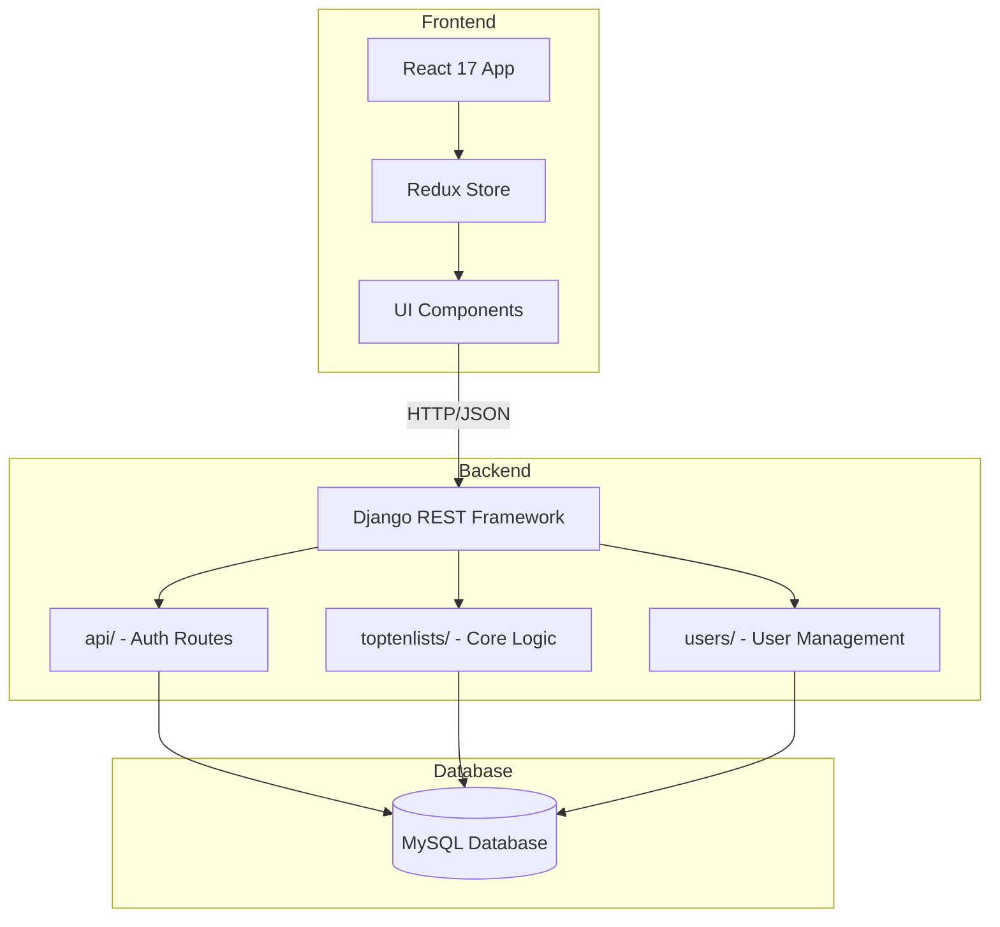
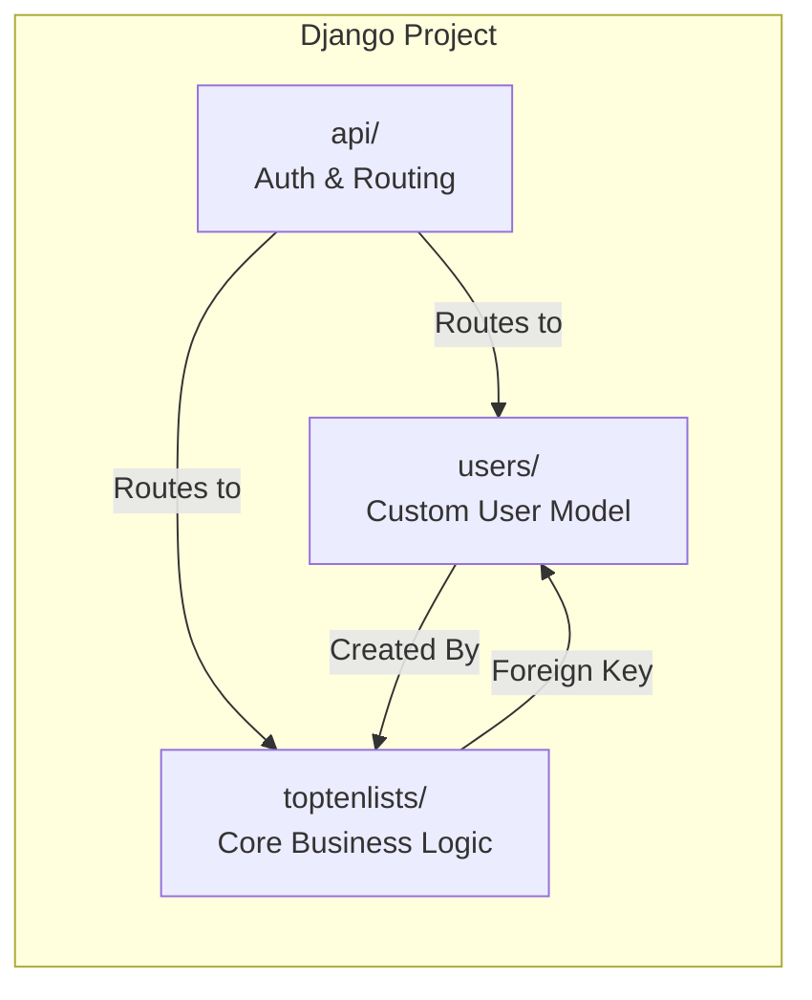
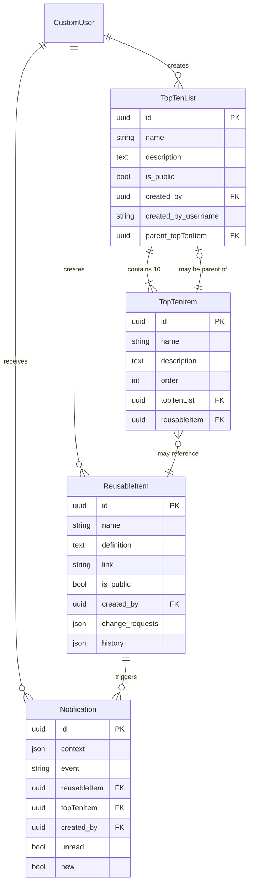
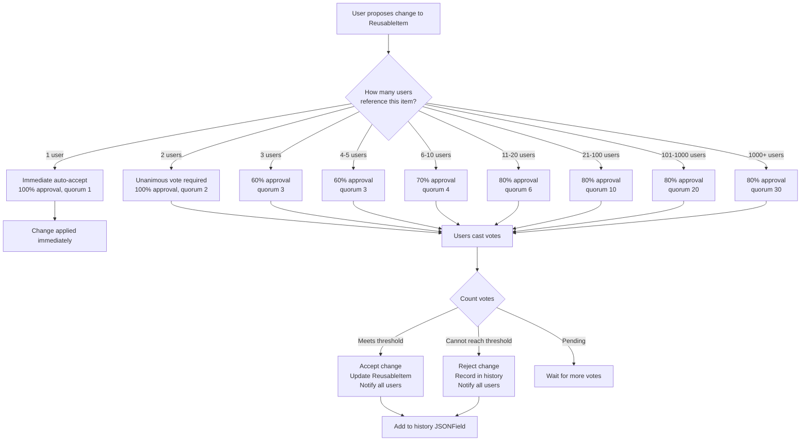
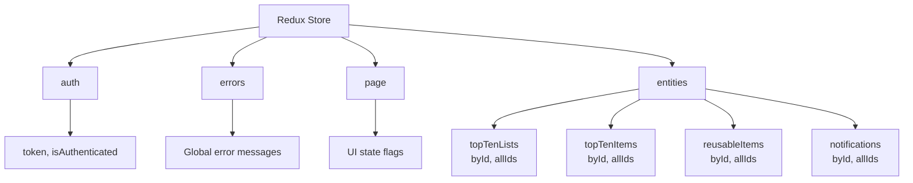

# MyTopTens Project - Technical Documentation

**Last Updated:** 2 January 2026  
**Status:** Migration in progress to Django 4.x and React 18

---

## Table of Contents

- [Project Overview](#project-overview)
- [Current Tech Stack](#current-tech-stack)
- [Architecture Overview](#architecture-overview)
- [Django Apps](#django-apps)
- [Database Models](#database-models)
- [API Structure](#api-structure)
- [Frontend Architecture](#frontend-architecture)
- [Key Features](#key-features)
- [Deployment](#deployment)
- [Known Issues](#known-issues)

---

## Project Overview

**MyTopTens** is a collaborative content platform where users create, share, and organize "Top Ten" lists on any topic. The key innovation is the **ReusableItem** system - users can create items that are reusable across multiple lists, with a democratic voting system for managing changes to shared items.

### Core Concept

Think of it as a collaborative knowledge base organized through ranked lists:

- Users create Top Ten lists (movies, books, recipes, etc.)
- Items in lists can reference shared "ReusableItems"
- When multiple users reference the same ReusableItem, changes require democratic approval
- Sophisticated voting algorithm scales from individual use to community consensus

---

## Current Tech Stack

### Backend (Python/Django)

| Component                 | Version | Notes                                 |
| ------------------------- | ------- | ------------------------------------- |
| **Django**                | 3.2.25  | LTS version (April 2021 - April 2024) |
| **Python**                | 3.7-3.9 | Based on Django 3.2 compatibility     |
| **Django REST Framework** | 3.13.1  | API framework                         |
| **Database**              | MySQL   | Using mysqlclient 2.2.4               |
| **django-mysql**          | 4.12.0  | MySQL-specific features               |
| **django-allauth**        | 0.57.2  | Email authentication                  |
| **dj-rest-auth**          | 5.0.2   | REST API auth endpoints               |
| **dynamic-rest**          | 2.1.2   | Nested serialization                  |
| **drf-flex-fields**       | 1.0.2   | Dynamic field expansion               |
| **drf-multiple-model**    | 2.1.3   | Multi-model queries                   |

### Frontend (React/Node)

| Component         | Version | Notes                      |
| ----------------- | ------- | -------------------------- |
| **React**         | 17.0.2  | Released October 2020      |
| **React DOM**     | 17.0.2  |                            |
| **React Router**  | 4.3.1   | v4 API (older)             |
| **Redux**         | 4.2.1   | State management           |
| **React-Redux**   | 7.2.9   | React bindings             |
| **Redux Thunk**   | 2.3.0   | Async middleware           |
| **Normalizr**     | 3.6.1   | Data normalization         |
| **Reselect**      | 4.0.0   | Memoized selectors         |
| **Bootstrap**     | 4.6.0   | UI framework               |
| **Reactstrap**    | 8.10.1  | React Bootstrap components |
| **Formik**        | 1.5.8   | Form management            |
| **react-scripts** | 5.0.1   | Create React App           |

---

## Architecture Overview

### High-Level Structure



### Django Apps Structure



### Three Django Apps

1. **`users/`** - Custom user authentication with email verification
2. **`toptenlists/`** - Core business logic (lists, items, voting)
3. **`api/`** - API routing hub and auth endpoints

---

## Django Apps

### 1. users/ - Custom User Management

**Purpose:** Extends Django's authentication system with email-based login and verification.

#### CustomUser Model

```python
from django.contrib.auth.models import AbstractUser
import uuid

class CustomUser(AbstractUser):
    id = models.UUIDField(primary_key=True, default=uuid.uuid4, editable=False)
    email = models.EmailField(unique=True)
    email_verified = models.BooleanField(default=False)
    # username inherited from AbstractUser
    # notifications field deprecated - see toptenlists.Notification

    USERNAME_FIELD = 'email'  # Use email for login
    REQUIRED_FIELDS = ['username']
```

**Key Features:**

- UUID primary keys (not sequential integers)
- Email-based authentication (no username required for login)
- Email verification workflow via django-allauth
- Case-insensitive username lookups via custom manager
- Token-based API authentication

**Files:**

- [models.py](users/models.py) - CustomUser model and manager
- [serializers.py](users/serializers.py) - User serialization for API
- [api.py](users/api.py) - User API views

---

### 2. toptenlists/ - Core Application

**Purpose:** Manages all list and item functionality including the collaborative voting system.

#### Model Relationships



#### TopTenList Model

**Purpose:** A user's ranked list of 10 items.

```python
class TopTenList(models.Model):
    id = models.UUIDField(primary_key=True, default=uuid.uuid4, editable=False)
    name = models.CharField(max_length=200)
    description = models.TextField(blank=True)
    is_public = models.BooleanField(default=False)

    created_by = models.ForeignKey(
        settings.AUTH_USER_MODEL,
        on_delete=models.CASCADE,
        related_name='topTenLists'
    )
    created_by_username = models.CharField(max_length=150)

    # Optional: nest this list under a TopTenItem
    parent_topTenItem = models.ForeignKey(
        'TopTenItem',
        on_delete=models.SET_NULL,
        null=True,
        blank=True,
        related_name='child_topTenList'
    )

    created_at = models.DateTimeField(auto_now_add=True)
```

**Key Fields:**

- `is_public` - Controls visibility to other users
- `parent_topTenItem` - Enables hierarchical lists (e.g., "Top Sci-Fi Movies" under "Movies")
- `created_by_username` - Denormalized for performance

---

#### TopTenItem Model

**Purpose:** Individual ranked items within a TopTenList (positions 1-10).

```python
class TopTenItem(models.Model):
    id = models.UUIDField(primary_key=True, default=uuid.uuid4, editable=False)
    name = models.CharField(max_length=200)
    description = models.TextField(blank=True)
    order = models.IntegerField(validators=[MinValueValidator(1), MaxValueValidator(10)])

    topTenList = models.ForeignKey(
        TopTenList,
        on_delete=models.CASCADE,
        related_name='topTenItem'
    )

    # Optional: reference a shared ReusableItem
    reusableItem = models.ForeignKey(
        'ReusableItem',
        on_delete=models.SET_NULL,
        null=True,
        blank=True,
        related_name='topTenItem'
    )

    class Meta:
        ordering = ['order']
```

**Key Behavior:**

- Exactly 10 items per list (enforced by `order` field: 1-10)
- Can optionally reference a ReusableItem for shared data
- Cascade deleted when parent TopTenList is deleted
- SET_NULL when referenced ReusableItem is deleted

---

#### ReusableItem Model - The Innovation!

**Purpose:** Shared items that multiple users can reference, with democratic change management.

```python
class ReusableItem(models.Model):
    id = models.UUIDField(primary_key=True, default=uuid.uuid4, editable=False)
    name = models.CharField(max_length=200)
    definition = models.TextField(blank=True)
    link = models.CharField(max_length=1000, blank=True)
    is_public = models.BooleanField(default=False)

    created_by = models.ForeignKey(
        settings.AUTH_USER_MODEL,
        on_delete=models.CASCADE,
        related_name='reusableItems'
    )

    # Change request system
    change_requests = models.JSONField(default=dict, blank=True)
    # Structure: {
    #   'proposed_changes': {...},
    #   'proposed_by': user_id,
    #   'proposed_at': timestamp,
    #   'votes': [user_id1, user_id2, ...]  # Never exposed in API
    # }

    history = models.JSONField(default=list, blank=True)
    # Structure: [
    #   {'changes': {...}, 'changed_at': timestamp, 'changed_by': user_id},
    #   ...
    # ]

    created_at = models.DateTimeField(auto_now_add=True)
```

**Key Features:**

- **Voting System:** Changes require approval from other users who reference the item
- **History Tracking:** All accepted changes preserved in `history` JSONField
- **Automatic Cleanup:** Deleted via signals when no TopTenItems reference it
- **Vote Privacy:** Vote lists never exposed through API

**Complex Methods:**

- `find_all_users_referencing_this_reusableItem()` - Find all users with items referencing this
- `get_referencing_user_count()` - Count how many users reference this item
- `record_vote()` - Record a user's vote and process results
- `get_voting_rules()` - Calculate required votes/quorum based on user count

---

#### Notification Model

**Purpose:** User notifications for ReusableItem events.

```python
class Notification(models.Model):
    id = models.UUIDField(primary_key=True, default=uuid.uuid4, editable=False)
    context = models.JSONField(default=dict)
    event = models.CharField(max_length=200)
    # Events: changeRequestCreated, changeRequestAccepted,
    #         changeRequestRejected, reusableItemDeleted, etc.

    reusableItem = models.ForeignKey(
        ReusableItem,
        on_delete=models.CASCADE,
        related_name='notifications'
    )
    topTenItem = models.ForeignKey(
        TopTenItem,
        on_delete=models.CASCADE,
        related_name='notifications',
        null=True
    )

    created_by = models.ForeignKey(
        settings.AUTH_USER_MODEL,
        on_delete=models.CASCADE,
        related_name='owned_notifications'
    )

    unread = models.BooleanField(default=True)
    new = models.BooleanField(default=True)
    created_at = models.DateTimeField(auto_now_add=True)
```

---

### 3. api/ - Authentication & Routing

**Purpose:** Centralized API routing hub and custom authentication forms.

**Key Files:**

- [urls.py](api/urls.py) - Main API routing
- [forms.py](api/forms.py) - Custom password reset forms
- [views.py](api/views.py) - Custom auth views
- **No models** - Pure routing/auth layer

**Routing Structure:**

```python
# api/urls.py
urlpatterns = [
    path('registration/', include('dj_rest_auth.registration.urls')),
    path('rest-auth/', include('dj_rest_auth.urls')),
    path('content/', include('toptenlists.endpoints')),
    # Custom endpoints for email confirmation, etc.
]
```

---

## Key Features

### Collaborative Voting System

The most sophisticated feature - a democratic system for managing changes to shared ReusableItems.

#### How It Works



#### Voting Rules Implementation

```python
# From toptenlists/serializers.py

@classmethod
def get_voting_rules(cls, number_of_selected_users):
    """
    Returns voting rules based on number of users referencing the ReusableItem.

    Rules scale with popularity:
    - Small groups: higher consensus required
    - Large groups: quorum prevents gridlock
    """
    voting_rules = [
        {'number_of_users': 1, 'quorum': 1, 'accept_percentage': 100},   # Immediate
        {'number_of_users': 2, 'quorum': 2, 'accept_percentage': 100},   # Unanimous
        {'number_of_users': 3, 'quorum': 3, 'accept_percentage': 60},
        {'number_of_users': 5, 'quorum': 3, 'accept_percentage': 60},
        {'number_of_users': 10, 'quorum': 4, 'accept_percentage': 70},
        {'number_of_users': 20, 'quorum': 6, 'accept_percentage': 80},
        {'number_of_users': 100, 'quorum': 10, 'accept_percentage': 80},
        {'number_of_users': 1000, 'quorum': 20, 'accept_percentage': 80},
        {'number_of_users': 5000, 'quorum': 30, 'accept_percentage': 80}
    ]

    # Find applicable rule
    selected_rule = voting_rules[-1]  # Default to max
    for rule in voting_rules:
        if number_of_selected_users <= rule['number_of_users']:
            selected_rule = rule
            break

    return selected_rule
```

#### Vote Processing Logic

```python
@classmethod
def count_votes(cls, instance):
    """
    Process votes and auto-accept/reject when thresholds are met.
    Called after each vote is cast.
    """
    change_request_votes_yes = instance.change_request_votes_yes.count()
    change_request_votes_no = instance.change_request_votes_no.count()
    total_votes = change_request_votes_yes + change_request_votes_no

    # Get number of users eligible to vote
    number_of_selected_users = cls.count_users(instance)
    selected_rule = cls.get_voting_rules(number_of_selected_users)

    max_votes = max(total_votes, selected_rule['quorum'])

    # AUTO-ACCEPT: Enough 'yes' votes
    if 100 * change_request_votes_yes / max_votes >= selected_rule['accept_percentage']:
        cls.accept_change(instance)
        # Notify all users who reference this item
        users = cls.find_users(instance)
        if users.count() > 1:
            cls.create_notification(instance, users, {
                'context': 'reusableItem',
                'event': 'changeRequestAccepted'
            })

    # AUTO-REJECT: Too many 'no' votes (cannot reach threshold)
    elif 100 * change_request_votes_no / max_votes > 100 - selected_rule['accept_percentage']:
        cls.reject_change(instance, 'rejected')
        # Notify all users
        users = cls.find_users(instance)
        if users.count() > 1:
            cls.create_notification(instance, users, {
                'context': 'reusableItem',
                'event': 'changeRequestRejected'
            })
```

#### Change Application

```python
@classmethod
def accept_change(cls, instance):
    """Apply approved changes and record in history."""
    history_entry = {
        'is_public': instance.is_public,
        'change_request': {},
        'changed_request_submitted_by_id': str(instance.change_request_by.id),
        'change_request_resolution': 'accepted',
        'changed_request_resolved_at': str(timezone.now()),
        'change_request_votes_yes_count': cls.get_change_request_votes_yes_count(cls, instance),
        'change_request_votes_no_count': cls.get_change_request_votes_no_count(cls, instance),
        'number_of_users': cls.count_users(instance)
    }

    # Apply each proposed change
    for key, value in instance.change_request.items():
        setattr(instance, key, value)
        history_entry['change_request'][key] = value

        # Special case: update name in all referencing TopTenItems
        if key == 'name':
            TopTenItem.objects.filter(reusableItem=instance).update(name=value)

    # Add to permanent history
    instance.history.append(history_entry)
    instance.modified_at = timezone.now()

    # Clear change request
    cls.remove_change_request(instance)
    instance.save()
```

#### Key Design Decisions

1. **Vote Privacy:** The `change_request_votes_yes` and `change_request_votes_no` ManyToMany fields are never exposed through the API - users see vote counts but not who voted.

2. **Dynamic Quorum:** The quorum scales with usage to prevent gridlock on popular items while maintaining consensus on personal items.

3. **History Preservation:** All changes (accepted or rejected) are preserved in the `history` JSONField for audit trails.

4. **Automatic Cleanup:** When a user de-references a ReusableItem, their votes are automatically removed (see [api.py](toptenlists/api.py) `TopTenItemViewSet.perform_update`).

5. **Immediate Acceptance:** Single-user items bypass voting - changes apply instantly.

---

### Nested List Capability

TopTenLists can be hierarchically organized by referencing TopTenItems as parents.

**Example Structure:**

```
Top 10 Movie Genres (TopTenList)
  ├── 1. Science Fiction (TopTenItem) ← parent_topTenItem
  │     └── Top 10 Sci-Fi Movies (TopTenList)
  ├── 2. Action (TopTenItem)
  │     └── Top 10 Action Movies (TopTenList)
  └── ...
```

**Implementation:**

```python
# TopTenList can reference a TopTenItem as parent
parent_topTenItem = models.ForeignKey(
    'TopTenItem',
    on_delete=models.SET_NULL,
    null=True,
    related_name='child_topTenList'
)
```

**Navigation:** The `TopTenListDetailViewSet` returns parent/child context for UI navigation.

---

### Automatic Resource Cleanup

Django signals maintain data integrity by auto-deleting orphaned ReusableItems.

```python
# toptenlists/signals.py

@receiver(post_save, sender=TopTenItem)
@receiver(post_delete, sender=TopTenItem)
def delete_unreferenced_reusable_item(sender, instance, **kwargs):
    """
    When a TopTenItem is saved or deleted, check if its ReusableItem
    is still referenced. If not, delete it.
    """
    if instance.reusableItem:
        reusable_item = instance.reusableItem

        # Count remaining references
        reference_count = TopTenItem.objects.filter(
            reusableItem=reusable_item
        ).count()

        if reference_count == 0:
            # TODO: Find out why created_by is sometimes None
            # Workaround: only delete if public or has creator
            if reusable_item.created_by or reusable_item.is_public:
                reusable_item.delete()
```

**Triggered by:**

- TopTenItem save (user de-references a ReusableItem)
- TopTenItem delete (item removed)
- TopTenList delete (cascade deletes all items)

---

## API Structure

### Authentication Endpoints

**Base Path:** `/api/v1/`

| Endpoint                               | Method | Purpose               |
| -------------------------------------- | ------ | --------------------- |
| `registration/`                        | POST   | User registration     |
| `rest-auth/login/`                     | POST   | Login (returns token) |
| `rest-auth/logout/`                    | POST   | Logout                |
| `rest-auth/password/reset/`            | POST   | Password reset        |
| `rest-auth/registration/verify-email/` | POST   | Verify email          |
| `sendconfirmationemail/`               | POST   | Resend confirmation   |

**Authentication:** Token-based via `rest_framework.authtoken`

```python
# Example login response
{
    "key": "9944b09199c62bcf9418ad846dd0e4bbdfc6ee4b",
    "user": {
        "id": "550e8400-e29b-41d4-a716-446655440000",
        "email": "user@example.com",
        "email_verified": true
    }
}
```

---

### Content Endpoints

**Base Path:** `/api/v1/content/`

All managed via DRF routers in [endpoints.py](toptenlists/endpoints.py)

#### TopTenList Endpoints

```python
# GET /api/v1/content/toptenlist/
# Query parameters:
#   listset: 'my-topTenLists' | 'public-topTenLists' | (all visible)
#   reusableItem: <uuid> - filter lists containing this item
#   created_by: <uuid> - filter by creator
#   created_by_username: <string> - filter by username (contains)
#   name: <string> - filter by list name (contains)
#   expand: 'topTenItem' - include nested items (FlexFields)

# Example with expansion:
GET /api/v1/content/toptenlist/<uuid>/?expand=topTenItem

Response:
{
    "id": "...",
    "name": "Top 10 Programming Languages",
    "description": "...",
    "is_public": true,
    "created_by": "...",
    "created_by_username": "alice",
    "topTenItem": [  # Expanded!
        {
            "id": "...",
            "name": "Python",
            "order": 1,
            "reusableItem": "..."
        },
        ...
    ]
}
```

#### TopTenItem Endpoints

```python
# GET /api/v1/content/toptenitem/
# PATCH /api/v1/content/toptenitem/<uuid>/
# PATCH /api/v1/content/toptenitem/<uuid>/moveup/  # Custom action

# Note: Cannot create/delete via API (managed by parent list)
```

**Move Up Action:**

```python
# Swap item order with item above it
PATCH /api/v1/content/toptenitem/<uuid>/moveup/

# Updates two items atomically
```

#### ReusableItem Endpoints

```python
# GET /api/v1/content/reusableitem/
# Query parameters:
#   id: <uuid> - get specific item

# PATCH /api/v1/content/reusableitem/<uuid>/
# Body can contain:
#   - Change to is_public
#   - New change_request
#   - Vote on existing change_request
#   - Cancel change_request

# Example change request:
PATCH /api/v1/content/reusableitem/<uuid>/
{
    "change_request": {
        "name": "New Name",
        "definition": "New definition"
    }
}

# Example vote:
PATCH /api/v1/content/reusableitem/<uuid>/
{
    "vote": "yes"  # or "no"
}

# Note: Cannot create/delete via API (managed by TopTenItem references)
```

#### Notification Endpoints

```python
# GET /api/v1/content/notification/
# Returns all notifications for authenticated user

# PATCH /api/v1/content/notification/<uuid>/
# Update 'unread' or 'new' status

# DELETE /api/v1/content/notification/deleteall/
# Delete all user's notifications
```

#### Search Endpoints

```python
# Multi-model search
GET /api/v1/content/searchlistsitems/?search=<query>
# Query parameters:
#   search: <string> - search term
#   includetoptenlists: true|false (default true)
#   includetoptenitems: true|false (default true)
#   excludereusableitems: true|false (default false)

# ReusableItem search
GET /api/v1/content/searchreusableitems/?search=<query>
```

---

### API Permissions

```python
# Custom permission classes

class IsOwner(permissions.BasePermission):
    """Only creator can view/edit (e.g., Notifications)"""
    def has_object_permission(self, request, view, obj):
        return obj.created_by == request.user

class IsOwnerOrReadOnly(permissions.BasePermission):
    """Public can read, only owner can edit"""
    def has_object_permission(self, request, view, obj):
        if request.method in permissions.SAFE_METHODS:
            return True
        return obj.created_by == request.user

class HasVerifiedEmail(permissions.BasePermission):
    """Write operations require verified email"""
    def has_permission(self, request, view):
        if request.method in permissions.SAFE_METHODS:
            return True
        if not request.user.is_authenticated:
            return False
        return EmailAddress.objects.get(user_id=request.user.id).verified
```

---

### API Throttling

```python
# djangoproject/settings/base.py

REST_FRAMEWORK = {
    'DEFAULT_THROTTLE_CLASSES': [
        'rest_framework.throttling.AnonRateThrottle',
        'rest_framework.throttling.UserRateThrottle'
    ],
    'DEFAULT_THROTTLE_RATES': {
        # Development (settings/development.py)
        'anon': '1000/day',
        'user': '60/minute'

        # Production (settings/production.py)
        'anon': '500/day',
        'user': '45/minute'
    }
}
```

---

## Frontend Architecture

### Technology Stack

- **React 17** with functional components and hooks
- **Redux** for global state management
- **Normalizr** for normalized entity storage
- **React Router v4** for routing
- **Reactstrap/Bootstrap 4** for UI
- **Axios** for HTTP requests
- **Formik** for forms

---

### Redux State Structure



**Normalized State Example:**

```javascript
{
    auth: {
        token: "9944b09199c62bcf9418ad846dd0e4bbdfc6ee4b",
        isAuthenticated: true,
        user: { id: "...", email: "..." }
    },
    entities: {
        topTenLists: {
            byId: {
                "uuid-1": { id: "uuid-1", name: "...", topTenItem: ["item-1", "item-2"] },
                "uuid-2": { id: "uuid-2", name: "...", topTenItem: ["item-3", "item-4"] }
            },
            allIds: ["uuid-1", "uuid-2"]
        },
        topTenItems: {
            byId: {
                "item-1": { id: "item-1", name: "Python", order: 1, reusableItem: "ri-1" },
                ...
            },
            allIds: ["item-1", "item-2", "item-3", "item-4"]
        },
        reusableItems: { ... },
        notifications: { ... }
    },
    errors: [],
    page: { ... }
}
```

---

### Normalizr Schemas

```javascript
// frontend/src/modules/topTenList.js

import { schema } from "normalizr";

// Define entity schemas
const topTenItem = new schema.Entity("topTenItems");
const reusableItem = new schema.Entity("reusableItems");
const notification = new schema.Entity("notifications");

const topTenList = new schema.Entity("topTenLists", {
  topTenItem: [topTenItem], // Array of items
});

// Define bidirectional relationships
topTenItem.define({
  reusableItem: reusableItem,
  topTenList: topTenList,
});

reusableItem.define({
  topTenItem: [topTenItem],
});

notification.define({
  reusableItem: reusableItem,
  topTenItem: topTenItem,
});
```

**Benefits:**

- Eliminates data duplication
- Easy updates (update once, reflects everywhere)
- Efficient lookups by ID
- Handles circular references

---

### React Router v4 Routes

```javascript
// frontend/src/containers/Root.js

<BrowserRouter>
  <div>
    <Navbar />
    <Switch>
      <Route exact path="/" component={Home} />
      <Route path="/newtoptenlist" component={CreateTopTenList} />
      <Route path="/toptenlist/:id" component={TopTenListDetail} />
      <Route path="/reusableitem/:id" component={ReusableItemDetail} />
      <Route path="/register" component={Register} />
      <Route path="/login" component={Login} />
      <Route path="/account" component={Account} />
      <Route path="/changepassword" component={ChangePassword} />
      <Route path="/forgotpassword" component={ForgotPassword} />
      <Route path="/emailverified/:key" component={EmailVerified} />
    </Switch>
  </div>
</BrowserRouter>
```

---

### Key Components

#### Container Components (Smart)

| Component              | Path                                                                              | Purpose               |
| ---------------------- | --------------------------------------------------------------------------------- | --------------------- |
| **Root**               | [containers/Root.js](frontend/src/containers/Root.js)                             | App root with routing |
| **Home**               | [containers/Home.js](frontend/src/containers/Home.js)                             | Main list view        |
| **CreateTopTenList**   | [containers/CreateTopTenList.js](frontend/src/containers/CreateTopTenList.js)     | List creation form    |
| **TopTenListDetail**   | [containers/TopTenListDetail.js](frontend/src/containers/TopTenListDetail.js)     | List detail page      |
| **ReusableItemDetail** | [containers/ReusableItemDetail.js](frontend/src/containers/ReusableItemDetail.js) | ReusableItem detail   |

#### Presentational Components

| Component                | Purpose                          |
| ------------------------ | -------------------------------- |
| **Navbar**               | Navigation with auth status      |
| **TopTenListsList**      | Grid of list cards               |
| **TopTenListSummary**    | Individual list card             |
| **TopTenItem**           | Draggable/editable list item     |
| **ReusableItemComboBox** | Search/select reusable items     |
| **ChangeRequestForm**    | Propose changes to ReusableItems |
| **NotificationsList**    | User notification feed           |
| **Organizer**            | List organization tool           |
| **IsPublicIndicator**    | Public/private toggle            |
| **Download buttons**     | Export functionality             |

---

### State Management Modules

```javascript
// frontend/src/modules/

auth.js; // Authentication (login, logout, token)
errors.js; // Global error handling
page.js; // UI state (loading, modals)
topTenList.js; // TopTenList CRUD + normalization
topTenItem.js; // TopTenItem CRUD
reusableItem.js; // ReusableItem CRUD + voting
notification.js; // Notification handling
rootReducer.js; // Combines all reducers
```

**Example Action Creator (with Redux Thunk):**

```javascript
// frontend/src/modules/topTenList.js

export const fetchTopTenLists = (params) => {
  return (dispatch) => {
    dispatch({ type: FETCH_TOPLISTS_REQUEST });

    return apiCall("toptenlist", params)
      .then((response) => {
        // Normalize response
        const normalized = normalize(response.data, [topTenListSchema]);

        dispatch({
          type: FETCH_TOPLISTS_SUCCESS,
          payload: normalized,
        });
      })
      .catch((error) => {
        dispatch({
          type: FETCH_TOPLISTS_FAILURE,
          payload: error,
        });
      });
  };
};
```

---

### API Utility Module

```javascript
// frontend/src/modules/api.js

import axios from "axios";

const API_BASE_URL =
  process.env.REACT_APP_API_URL || "http://localhost:8000/api/v1/";

export const apiCall = (endpoint, params = {}, method = "GET", data = null) => {
  const token = localStorage.getItem("token");

  const config = {
    method,
    url: `${API_BASE_URL}content/${endpoint}/`,
    params,
    data,
    headers: token ? { Authorization: `Token ${token}` } : {},
  };

  return axios(config);
};

// Permission checks
export const canEdit = (obj, user) => {
  return obj.created_by === user.id;
};

// File download
export const downloadFile = (content, filename, contentType) => {
  const blob = new Blob([content], { type: contentType });
  const url = URL.createObjectURL(blob);
  const link = document.createElement("a");
  link.href = url;
  link.download = filename;
  link.click();
};
```

---

## Deployment

### Build Process

```bash
# buildapp.sh

#!/bin/bash
# Load environment variables
set -a
source .env
set +a

# Build React frontend
cd frontend
npm run build

# Move build to Django static files
cd ..
rm -rf assets/
mv frontend/build assets/

# Collect Django static files
python manage.py collectstatic --noinput

# Record Python dependencies
pip freeze > requirements_frozen.txt

# Run database migrations
python manage.py migrate
```

### Deployment Script

```bash
# deployapp.sh

#!/bin/bash
./buildapp.sh

# Additional deployment steps (restart server, etc.)
# Implementation depends on hosting environment
```

### WSGI Configuration

```python
# passenger_wsgi.py (for Phusion Passenger hosting)

import os
import sys
from dotenv import load_dotenv

# Load environment variables from .env
dotenv_path = os.path.join(os.path.dirname(__file__), '.env')
load_dotenv(dotenv_path)

# Add project to path
sys.path.insert(0, os.path.dirname(__file__))

# Set Django settings
os.environ.setdefault('DJANGO_SETTINGS_MODULE', 'djangoproject.settings.production')

# Import Django application
from django.core.wsgi import get_wsgi_application
application = get_wsgi_application()
```

### Settings Structure

```
djangoproject/settings/
├── __init__.py
├── base.py          # Shared settings
├── development.py   # DEBUG=True, relaxed throttling
└── production.py    # DEBUG=False, strict throttling
```

**Key Production Settings:**

```python
# djangoproject/settings/production.py

DEBUG = False
ALLOWED_HOSTS = ['mytoptens.com', 'www.mytoptens.com']

REST_FRAMEWORK = {
    'DEFAULT_THROTTLE_RATES': {
        'anon': '500/day',
        'user': '45/minute'
    }
}

# Database from database.cnf
DATABASES = {
    'default': {
        'ENGINE': 'django.db.backends.mysql',
        'OPTIONS': {
            'read_default_file': os.path.join(BASE_DIR, 'database.cnf'),
            'charset': 'utf8mb4'
        }
    }
}
```

### Database Configuration

```ini
# database.cnf

[client]
database = mytoptens
user = mytoptens_user
password = <password>
host = localhost
default-character-set = utf8mb4
```

---

## Architectural Patterns

### 1. UUID Primary Keys

All models use UUIDs instead of sequential integers:

```python
id = models.UUIDField(primary_key=True, default=uuid.uuid4, editable=False)
```

**Benefits:**

- Better security (unpredictable IDs)
- Easier distributed systems/merging
- No ID conflicts when syncing data

---

### 2. JSONField for Flexible Data

Extensive use of PostgreSQL/MySQL JSONField:

```python
# ReusableItem
change_request = models.JSONField(default=dict, blank=True, null=True)
history = models.JSONField(default=list, blank=True)

# Notification
context = models.JSONField(default=dict)
```

**Use Cases:**

- Change request storage (variable fields)
- History tracking (append-only log)
- Notification context (flexible metadata)

---

### 3. FlexFields Dynamic Expansion

Reduces API round-trips with opt-in nested data:

```python
# Without expansion
GET /api/v1/content/toptenlist/
# Returns: { id, name, topTenItem: ["id1", "id2", ...] }

# With expansion
GET /api/v1/content/toptenlist/?expand=topTenItem
# Returns: { id, name, topTenItem: [{...full object...}, ...] }
```

**Implementation:**

```python
from rest_flex_fields import FlexFieldsModelViewSet

class TopTenListViewSet(FlexFieldsModelViewSet):
    permit_list_expands = ['topTenItem']
    serializer_class = TopTenListSerializer
```

---

### 4. Denormalization for Performance

```python
# TopTenList stores username to avoid JOIN
created_by_username = models.CharField(max_length=255)

# Set on save
def perform_create(self, serializer):
    serializer.save(
        created_by=self.request.user,
        created_by_username=self.request.user.username
    )
```

---

### 5. Signal-Based Cleanup

Automatic resource management via Django signals:

```python
from django.db.models.signals import post_save, post_delete
from django.dispatch import receiver

@receiver(post_save, sender=TopTenItem)
@receiver(post_delete, sender=TopTenItem)
def delete_unreferenced_reusable_item(sender, instance, **kwargs):
    # Auto-delete ReusableItems with no references
    if instance.reusableItem:
        if not TopTenItem.objects.filter(
            reusableItem=instance.reusableItem
        ).exists():
            instance.reusableItem.delete()
```

---

### 6. Permission Layering

Multiple permission classes combined:

```python
class TopTenListViewSet(FlexFieldsModelViewSet):
    permission_classes = [IsOwnerOrReadOnly, HasVerifiedEmail]
    # User must pass BOTH permission checks
```

**IsOwnerOrReadOnly:** Public read, owner-only write  
**HasVerifiedEmail:** Write operations require verified email

---

### 7. Normalized Redux State

Using Normalizr for flat, efficient state:

```javascript
// Before normalization (nested, duplicated)
{
    lists: [
        {
            id: 1,
            items: [
                { id: 'a', reusableItem: { id: 'r1', name: 'Python' } },
                { id: 'b', reusableItem: { id: 'r1', name: 'Python' } }  // Duplicate!
            ]
        }
    ]
}

// After normalization (flat, single source of truth)
{
    topTenLists: { byId: { 1: { id: 1, topTenItem: ['a', 'b'] } }, allIds: [1] },
    topTenItems: { byId: { a: { id: 'a', reusableItem: 'r1' }, b: { ... } }, allIds: ['a', 'b'] },
    reusableItems: { byId: { r1: { id: 'r1', name: 'Python' } }, allIds: ['r1'] }
}
```

**Benefits:**

- Update once, reflects everywhere
- No data duplication
- Efficient lookups

---

## Known Issues

### Critical TODOs

#### 1. ReusableItem Orphan Issue

**Location:** [signals.py](toptenlists/signals.py#L23)

```python
# TODO: Find out why this happened and stop it
if reusable_item.created_by is None and not reusable_item.is_public:
    # Don't delete orphaned private items with no creator
    return
```

**Issue:** ReusableItems occasionally have `created_by=None`, cause unknown.

**Current Workaround:** Skip deletion if private and no creator.

**Impact:** May leave orphaned private items in database.

---

#### 2. Test Coverage Gaps

**Location:** [test_reusableitem_api.py](toptenlists/tests/test_reusableitem_api.py)

```python
# Line 526
# TODO: Three users should reference the ReusableItem so it is not deleted

# Line 527
# TODO: Loop to create 10 users each with a Top Ten List
```

**Issue:** Complex voting scenarios not fully tested.

**Impact:** Edge cases in voting system may have bugs.

---

### Technical Debt

#### 1. Deprecated jQuery

```json
// frontend/package.json
"jquery": "^3.6.4"
```

**Issue:** jQuery unnecessary with React, potential conflicts.

**Resolution:** Remove jQuery dependency, audit for usage.

---

#### 2. React Router v4 API

**Issue:** Using React Router v4 (released 2017), current is v6.

**Changes Required for v6:**

- `Switch` → `Routes`
- `<Route component={...}>` → `<Route element={<Component />}>`
- `match.params` → `useParams()` hook
- `history.push()` → `navigate()` hook

---

#### 3. Django 2.x Migration Files

```python
# migrations/0001_initial.py
# Generated by Django 2.0.10 on 2019-09-22 13:07
```

**Issue:** Migrations created with Django 2.0, now on 3.2.

**Impact:** May have compatibility issues when upgrading to Django 4.x+.

**Resolution:** Consider squashing migrations after upgrading.

---

#### 4. Bootstrap 4

**Issue:** Using Bootstrap 4.6.0, current is Bootstrap 5.

**Changes in Bootstrap 5:**

- jQuery removed (good!)
- Class name changes (`ml-*` → `ms-*`, `mr-*` → `me-*`)
- Dropped IE support
- Utility API redesign

---

### Migration Priority

See [UPGRADE_PLAN.md](UPGRADE_PLAN.md) for detailed migration steps.

**Recommended Order:**

1. Django 3.2 → 4.2 LTS (April 2026 support ends for 3.2)
2. Python dependencies (django-allauth, dj-rest-auth, DRF)
3. React 17 → 18 (minor breaking changes)
4. React Router v4 → v6 (major refactor)
5. Bootstrap 4 → 5 (moderate changes)

---

## Database Schema

### Entity Counts (Typical Installation)

- **Users:** Varies
- **TopTenLists:** ~10 per user
- **TopTenItems:** 10 per list (fixed)
- **ReusableItems:** Shared pool, grows with usage
- **Notifications:** ~1-5 per ReusableItem change event

### Storage Considerations

- **UUIDs:** 36 characters per ID (vs 4-8 bytes for integers)
- **JSONFields:** Variable size, can grow large for popular ReusableItems
- **Indexes:** On foreign keys, `is_public`, `created_by`

---

## Testing

### Test Files

```
users/tests/
└── test_users_api.py

toptenlists/tests/
├── test_models.py
├── test_notification_api.py
├── test_reusableitem_api.py
└── test_toptenlist_api.py
```

### Running Tests

```bash
# All tests
python manage.py test

# Specific app
python manage.py test toptenlists

# Specific test file
python manage.py test toptenlists.tests.test_reusableitem_api
```

---

## Development Workflow

### Starting Development Server

```bash
# Backend (Django)
./rundevserver.sh
# Runs on http://localhost:8000

# Frontend (React)
cd frontend
npm start
# Runs on http://localhost:3000
```

### Hot Module Replacement

Both Django (with `--reload`) and React (via react-scripts) support HMR.

### Environment Variables

```bash
# .env (not in git)
DEBUG=True
SECRET_KEY=<your-secret-key>
DATABASE_PASSWORD=<db-password>
ALLOWED_HOSTS=localhost,127.0.0.1
```

---

## Further Documentation

- **Migration Plan:** See [UPGRADE_PLAN.md](UPGRADE_PLAN.md) for step-by-step upgrade instructions
- **API Reference:** See DRF browsable API at `/api/v1/` when `DEBUG=True`
- **Model Reference:** See Django admin at `/admin/` for model documentation

---

**Document Version:** 1.0  
**Last Updated:** 2 January 2026  
**Maintained By:** Development Team
